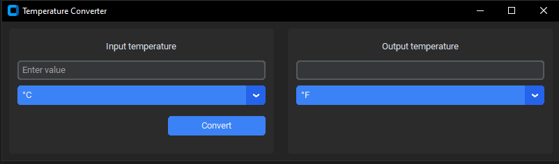
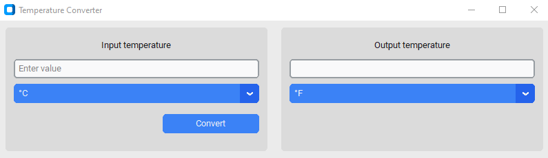

# Temperature Converter App

A tiny desktop app to convert temperature between °C, °F, and K using __CustomTkinter__.

# Features
* Convert between Celsius, Fahrenheit, and Kelvin

* Simple two-column layout (input → output)

* Keyboard: Enter to convert

* Read-only output field

* Light/Dark mode support

# App Screenshots
## Dark mode

## Light mode

# Tech Stack
* Python 3.13.3
* CustomTkinter

# Installation
1) __Clone the repository__
* `git clone https://github.com/Dante-AleX/temperature_converter_app`
* `cd .\temperature-converter\`

2) __Create a virtual environment (Optional)__  
* `python -m venv .venv` 
* __Windows:__ `.venv\Scripts\activate`
* __macOS/Linux:__ `source .venv/bin/activate`

3) __Install the dependencies__
* `pip install -r requirements.txt`

4) __Usage__  
* `python main.py`

# Project Structure
temperature-converter/  
├─ assets/  
├─ main.py  
└─ requirements.txt